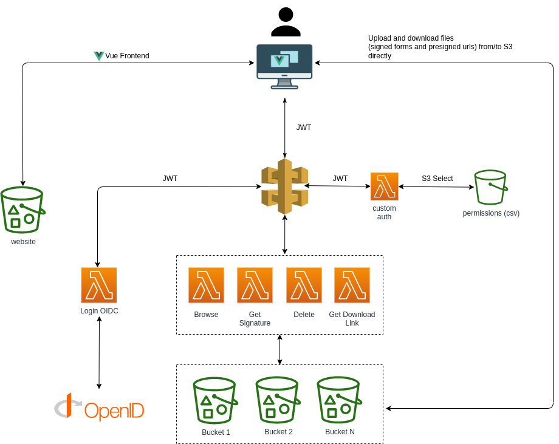

# AWS sFTP S3 Serverless

The goal of this project is to provide a space for users under AWS S3 buckets (shared S3 buckets with a "folder" for every user), with a web interface to upload, browse, download and remove files.

Features:

* It's possible to setup "users" and "admins". 

* A **user** adds its username (email from saml response) to each key (uploading, browsing, deleting...) . An **admin** can see everything under a bucket or a folder. See [permissions.csv](data/permissions.csv).
    - You need a Custom Authorizer for your API Gateway to validate JWT Token (sample here [backend/custom-auth/index.js](backend/custom-auth/index.js)). 
    - Our [custom authorizer](backend/custom-auth/index.js) queries with S3 Select the CSV and retrieves the permissions for a user and adds the buckets, folders and roles to the context. 

* Access: "read only" or "read write", both for "admin" or "user":

    - See [permissions.csv](data/permissions.csv)
    - If not setted default is "rw" 
    - values: rw | ro

* A user can upload folders (drag and drop) and the structure is recreated in S3

* Files can be downloaded (not directories)

* Folders can be deleted (included not empty)

* A user can create a folder

* Files can be shared: you can put a cloudfront distribution over S3 bucket and get the link to that file. 

  * If a bucket is private to Campus UOC, you can use "Campus Cloudfront Signed Cookies" to allow access to that bucket (only need to trust NPLIN account as signer)
  * For public buckets no authentication is required to access files

* Access can be allowed through "campusJWT" cookie or with SAML login from WebFTP application.

## Architecture

 

## Quick deploy

* Install serverless framework: https://www.serverless.com/framework/docs/getting-started/

* Setup AWS credentials: https://www.serverless.com/framework/docs/providers/aws/cli-reference/config-credentials/

```sh
export AWS_ACCESS_KEY_ID="\<key\>"
export AWS_SECRET_ACCESS_KEY="\<secret\>"
export AWS_SESSION_TOKEN="\<token\>"
```

* Define a json file for each environment with this structure:

```json
{
  "ci": "webftp",
  "UOCEnv": "<env>",
  "Departament": "uocit",
  "Programa": "TECNO",
  "IDP_HOST": "<host>",
  "API_PATH": "/api",
  "DOMAIN": "<domain>",
  "DOMAIN_CERT_ARN": "<cert-arn>",
  "PUBLIC_CDN_DOMAIN": "<domain>",
  "PUBLIC_CDN_DOMAIN_CERT_ARN": "<cert-arn>",
  "PROTECTED_CDN_DOMAIN": "<domain>",
  "PROTECTED_CDN_DOMAIN_CERT_ARN": "<cert-arn>"
}
```

* AWS SSM must contain de following parameters with the proper values:
    * /\<stage\>/webftp/JWT_SECRET
    * /\<stage\>/webftp/SAML_CERT

You can change all the values but we maintain some of them for you that can be standardized.

These specific environment files needed for deploy must be placed in ~/.config/sls/webftp.\<env\>.json

* Execute [deploy.sh](deploy.sh) (give it executable permissions)

        $ chmod +x deploy.sh && sh deploy.sh --environment=<env>

* If you are using https://samltest.id, follow this additional steps:
    * Execute [STAGE=$ENVIRONMENT node setup] It will modify some files in order to make all work. Go to https://samltest.id/upload.php and upload manually [docs/sp-metadata.xml](docs/sp-metadata.xml). 

* For development, run your server and try

        $ npm run serve --prefix=frontend

## Deployment details

* Build Backend

        $ cd backend
        $ npm run build

* Build Frontend

        $ npm --prefix ./frontend install ./frontend
        $ cd frontend
        $ npm run build

* Deploy backend

        $ cd backend
        $ sls deploy --stage=<env>

* Deploy frontend

        $ cd frontend
        $ aws s3 sync ./frontend/dist s3://webftp-web-<env>
        $ aws s3 cp admin/error/index.html s3://webftp-protected-files-<env>/error/index.html

If you are using https://samltest.id, follow this additional steps:

* Update your [sp-metadata.xml](docs/sample-sp-metadata.xml) with:
    * your issuer
    * your domain
    * your api path

* Upload this file to https://samltest.id/upload.php

## Sample interface


## Backend

1. [Upload](backend/form-signing-sdk/index.js): this lambda generates the signature for valid uploads. 

1. [Browsing](backend/browsing/index.js): this lambda retrieves the objects in a path

1. [Delete](backend/delete-keys/index.js): this lambda deletes recursively all objects in a path

1. [Download](backend/get-presigned-urls/index.js): this lambda generate presigned urls for objects to be downloaded safely

1. [GetConfig](backend/get-config/index.js): function to get cdn domain vs buckets setup.

1. [Login](backend/login/app.js): in this case SAML based to generate a JWT token.

1. [Custom authorizer](backend/custom-auth/index.js): validates JWT token and adds extra permissions from [CSV](data/permissions.csv)

## Frontend

* Frontend is Vue based (v3). Follow the [Getting Started](https://vuejs.org/guide/introduction.html)

## Simple checks for UOC WEBFTP

### App

These are a simple checks to validate that the application is up and running:

* Access the config service:
    - TEST -> https://ftp.test.uoc.edu/api/getconfig
    - PRE ->  https://ftp.pre.uoc.edu/api/getconfig
    - PRO ->  https://ftp.uoc.edu/api/getconfig

The result must be a json like this:

```json
{
  "cdnDomains": {
    "webftp-files-pro": "xxx",
    "webftp-protected-files-pro": "xxx"
  }
}
```

* Validate login and permissions:
    - TEST -> https://ftp.test.uoc.edu/
    - PRE ->  https://ftp.pre.uoc.edu/
    - PRO ->  https://ftp.uoc.edu/

Enter UOC credentials, if you have permissions in some data bucket you will see the logical name of this bucket (Ex. campus, public,...) and navigate around the folders, upload/download/delete files, ... Otherwise a "you don't have permissions" will be showed

### CDN

#### Protected content (requires "Campus Cloudfront Signed Cookies")

- TEST -> https://protected-content.ftp.test.uoc.edu/
- PRE ->  https://protected-content.ftp.pre.uoc.edu/
- PRO ->  https://protected-content.ftp.uoc.edu/

The result will be the following:

```
Error d'autenticació
Accedeix a Campus mitjançant l'enllaç de sota, i un cop hagis fet login, refresca aquesta pàgina per poder accedir al contingut
```

Once logged in Campus, you can access files through the share link provided in the web application.

#### Public content

- TEST -> https://public-content.ftp.test.uoc.edu/
- PRE ->  https://public-content.ftp.pre.uoc.edu/
- PRO ->  https://public-content.ftp.uoc.edu/

# Cross account buckets

Ref: https://www.wellarchitectedlabs.com/security/300_labs/300_lambda_cross_account_bucket_policy/

Add bucket policy (in another account)

    {
        "Version": "2012-10-17",
        "Statement": [
            {
                "Sid": "CrossAccountWebFtpBucket",
                "Effect": "Allow",
                "Principal": {
                    "AWS": "arn:aws:iam::[accountid]:role/[webftp-role]"
                },
                "Action": "s3:*",
                "Resource": [
                    "arn:aws:s3:::[bucketname]",
                    "arn:aws:s3:::[bucketname]/*"
                ]
            }
        ]
    }

Setup CORS in bucket

    [
        {
            "AllowedHeaders": [],
            "AllowedMethods": [
                "GET",
                "POST",
                "HEAD"
            ],
            "AllowedOrigins": [
                "*"
            ],
            "ExposeHeaders": []
        }
    ]


# TODO

* Implement routes to share access to path inside WebFTP
* Social Login
* Quotas
* New role superadmin --> hability to "archive", send to glacier a folder

